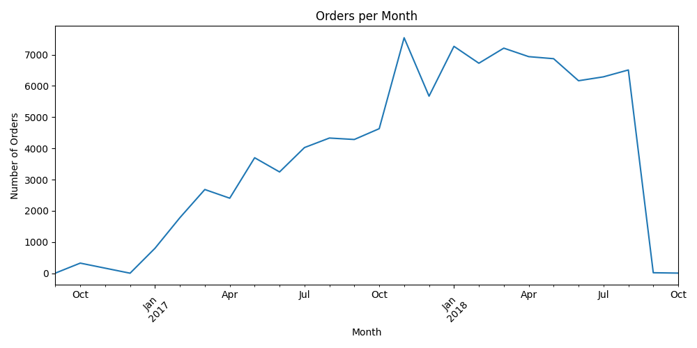
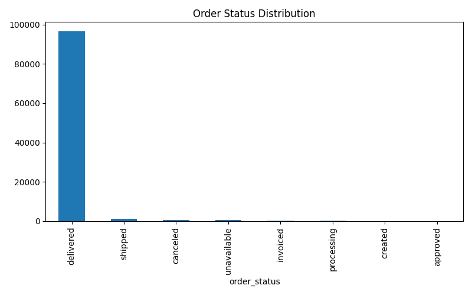

# E-Commerce Orders Data Analysis using Python

This project performs Exploratory Data Analysis (EDA) on a real-world e-commerce orders dataset to identify trends, order distribution, and business insights. The analysis focuses on understanding order growth patterns and delivery performance.

## Project Objective

The objective of this project is to:
- Analyze monthly order trends
- Understand order status distribution
- Identify business growth patterns
- Generate insights from raw order data
- Visualize results using Python

## Dataset

The dataset contains e-commerce order information including:
- Order ID
- Customer ID
- Order status
- Purchase timestamp
- Delivery information

Dataset used: `olist_orders_dataset.csv`

## Tools & Technologies

- Python  
- Pandas  
- Matplotlib  
- Data Cleaning  
- Exploratory Data Analysis (EDA)  

## Analysis Performed

### 1. Monthly Orders Trend
Analyzed the number of orders placed each month to identify growth trends and seasonal patterns.



### 2. Order Status Distribution
Analyzed order completion and delivery performance using order status breakdown.



## Key Insights

- Orders showed consistent growth over time  
- Majority of orders were successfully delivered  
- Very small percentage of orders were cancelled or unavailable  
- Monthly trends indicate steady customer demand  
- Delivery performance remained stable across months  

## Project Structure

```
ecommerce-orders-python-analysis
│
├── retail_sales_analysis.py
├── monthly_orders.png
├── order_status.png
└── README.md
```

## How to Run the Project

### 1. Install Required Libraries

```bash
pip install pandas matplotlib
```

### 2. Place Dataset

Download dataset and place it in the same folder:

```
olist_orders_dataset.csv
```

### 3. Run Python Script

```bash
python retail_sales_analysis.py
```

## Output

The script generates the following visualizations:

- Monthly Orders Trend Chart
- Order Status Distribution Chart

These charts help understand order growth and delivery performance.

## Skills Demonstrated

- Data Cleaning  
- Exploratory Data Analysis  
- Data Visualization  
- Real-world dataset handling  
- Business insight generation  
- Python data analysis workflow  

## Future Improvements

- Add revenue analysis  
- Customer segmentation  
- Delivery time analysis  
- Region-wise order analysis  
- Interactive dashboard  

## Author

Charan  
Aspiring Data Analyst  
GitHub: https://github.com/charan230105
